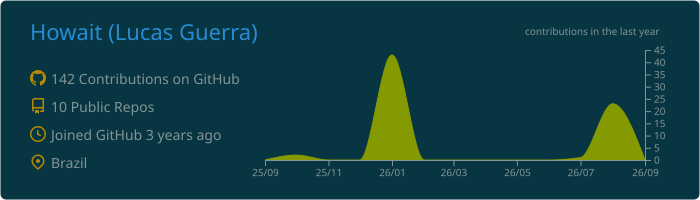
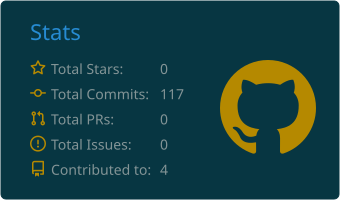
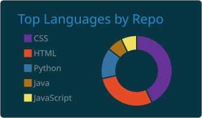
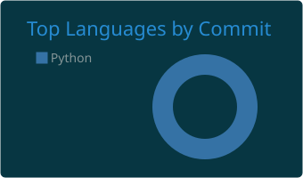

  
<i>Desenvolvedor de Software / Engenheiro de IA</i>

  <!-- Animação da Cobrinha -->
  <picture>
    <source media="(prefers-color-scheme: dark)" srcset="https://raw.githubusercontent.com/Howait/Howait/output/github-contribution-grid-snake-dark.svg">
    <source media="(prefers-color-scheme: light)" srcset="https://raw.githubusercontent.com/Howait/Howait/output/github-contribution-grid-snake.svg">
    
  </picture>

---

### Sobre Mim
- Atualmente trabalhando e estudando **[]**
- Experiência com **Backend, APIs REST, e Inteligência Artificial**
- Curiosidade: Apaixonado por resolução de problemas e otimização de processos.

---

### Stacks & Tecnologias

#### Linguagens & Backend

#### Bancos de Dados & Ferramentas

---
### Estatísticas do GitHub

  
  
    
  
  

---

### Como me encontrar

